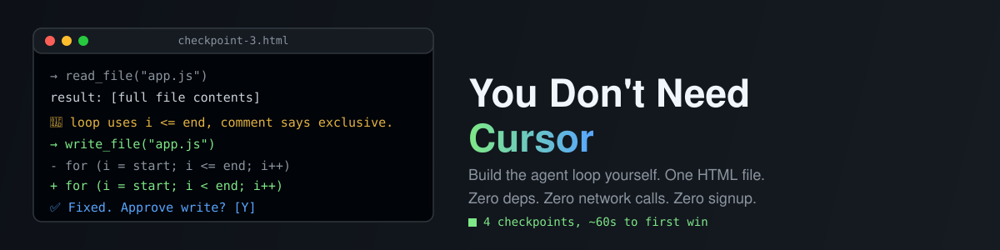

# You Don't Need Cursor



**Zero dependencies. Zero API keys. Zero network requests. One HTML file that teaches you exactly what your AI coding tool is doing behind the loading spinner.**

## What this is

Cursor, Claude Code, Aider, Copilot Workspace — underneath the polish, they're all running the same small loop: send the model a message, let it call tools, keep going until it's done or runs out of leash, and decide which actions need a human's okay. That loop is the whole product. This is a from-scratch, interactive walkthrough of building it, four checkpoints at a time — and you don't read about it, you **run** it, against a tiny simulated repo, in your own browser.

There's no real model here (see [Why this exists](#why-this-exists) for why that's the point, not a limitation) — a small deterministic script stands in for one, so the whole thing works offline with no signup and no API key.

## 60-second quick start

```
git clone <this-repo>
cd you-dont-need-cursor
python3 -m http.server 8000   # or: npx serve, or just double-click index.html
```

Open `http://localhost:8000` (or the file directly), pick a task from the dropdown on **Checkpoint 0**, hit **▶ Run**, and watch the "model" confidently make something up about a file it's never seen. That's the whole first win, and it takes about ten seconds.

Then click through Checkpoints 1–3 to watch the same task get handled by progressively less-clumsy versions of the harness — tools with no loop, a loop with too short a leash, and finally a real loop with an approval gate you can toggle on and off.

## The four checkpoints

| # | Name | What changes | What you learn |
|---|------|--------------|-----------------|
| 0 | Hello, Loop | Nothing — no tools, one message in, one message out | It hallucinates. It has never seen your files. |
| 1 | Give It Hands | Tools exist (`list_files`, `read_file`, `write_file`)... but the harness allows exactly **one** tool call before it must answer | Tools without a loop are a fancy man page — it can look, barely, but it can't act |
| 2 | Give It a Leash | A real `for` loop with a `maxTurns` budget you control | Set the leash too short and a correct fix gets cut off mid-task. That's a harness bug, not a model bug |
| 3 | The Approval Gate | Every `write_file` call can require a human click before it runs | The opinionated default lives here — see below |

## A worked example (this is real output from the tool, not marketing copy)

**Checkpoint 0**, task "Fix the off-by-one bug in app.js," no tools:

> Off-by-one bugs are almost always a loop boundary problem — check whether your condition should be "<" instead of "<=" (or vice versa). Also worth double-checking whether your array indices start at 0. Let me know if that doesn't do it!

Confident. Generic. Never opened the file. The bug in `app.js` is a doc comment promising `end` is exclusive while the loop uses `i <= end` — the model's guess happens to be in the right neighborhood, which is almost worse, because you'd have no way to tell that from a chat window alone.

**Checkpoint 2**, same task, `maxTurns` raised high enough to finish:

```
→ list_files()
result: README.md / app.js / report.js / utils.js

→ read_file("app.js")
result: [full file contents]

💭 The comment promises end is exclusive, but the loop uses `i <= end`,
   which includes it. That's the bug — fixing it.
→ write_file("app.js")
result: app.js updated (10 lines).
- for (let i = start; i <= end; i++) {
+ for (let i = start; i < end; i++) {

→ read_file("app.js")
result: [fixed file contents]

✅ Fixed — changed `i <= end` to `i < end` on line 4, so the loop stops
   before `end`, matching the doc comment.
```

Same task, same fake model. The only thing that changed is the shape of the harness around it.

## The opinionated default (this is the part that'll start a fight)

**Checkpoint 3 ships with auto-approve ON.** Every confirmation dialog you click through is a tax on the one thing that makes agent-assisted coding actually feel good: flow. If your sandbox can't survive an agent writing a bad file, the sandbox is the bug, not the agent. Flip the toggle off if you disagree — that argument is the entire point of the checkpoint, and it's the same argument every real coding-agent team has had internally at least once.

## Why this exists

Every agent-in-an-editor product hides the same four ideas behind a much nicer UI: a message, a tool call, a loop, and a permission policy. Once you've wired that loop together yourself — badly at first, on purpose, at Checkpoint 0 and 1 — you stop being intimidated by the "AI coding agent" black box, and you start noticing exactly which defaults your actual tools picked *for* you without asking. That's a more useful thing to walk away with than another chat window.

## What's true about the numbers above

The transcript in the worked example is copy-pasted from an actual run of this tool's Checkpoint 0 and Checkpoint 2, verified against the code in `index.html` (see `.starforge/verify.json` for how). It is **not** a benchmark of a real LLM — the "model" here is a fixed script, so there's nothing to benchmark. What it does demonstrate faithfully is the *shape* of the harness: which calls happen, in what order, and what a `maxTurns` budget or a denied write actually does to the outcome.

## Why zero dependencies

The whole app is one `index.html` — inline CSS, inline JS, no build step, no `npm install`, no bundler. For a tool whose entire pitch is "understand the loop with nothing hidden," a dependency tree would be the first thing undermining that pitch. Modern browsers already ship everything this needs (native `<template>`-free DOM APIs, CSS custom properties, `Promise`/`async`/`await`) — reaching for a framework here would be adding weight to remove exactly zero real problems.

## Trust, in full

- **No network requests.** Not to an LLM API, not to a CDN, not to a font host, not anywhere. Open your browser's Network tab while using this page and it will stay empty — that's not a claim, go check.
- **No telemetry, no analytics, no cookies, no localStorage.** Nothing persists between visits; every checkpoint resets to its initial state on reload.
- **No API keys, no accounts, no signup.** There is nothing to configure because there is no real model to configure a connection to.
- **No `eval`, no dynamically-fetched code.** Everything that runs is in this repo, in one file, readable top to bottom.

## Swapping in a real model

The mock "model" is just a JavaScript function (`runTask` in `index.html`) that returns a fixed sequence of tool calls for three built-in demo tasks. A real integration would replace that fixed sequence with an actual API call inside the loop shown in each checkpoint's code pane — the harness code around it (the `for` loop, the tool dispatch, the approval gate) barely changes. That's deliberately left as an exercise rather than built in, so this tool can make the "zero network requests" promise above without any asterisks.

## Changelog

- **Fixed #1** — README had no banner, so shared links (Slack, X, GitHub social preview) rendered as grey nothing. Added a hand-authored SVG banner (`banner.svg`, no external references) and a README hero image.

## License

MIT — see [LICENSE](LICENSE).
